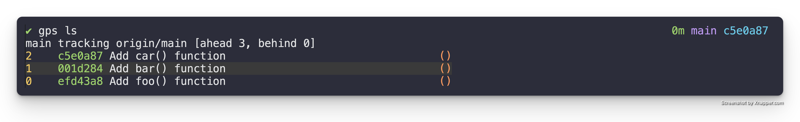
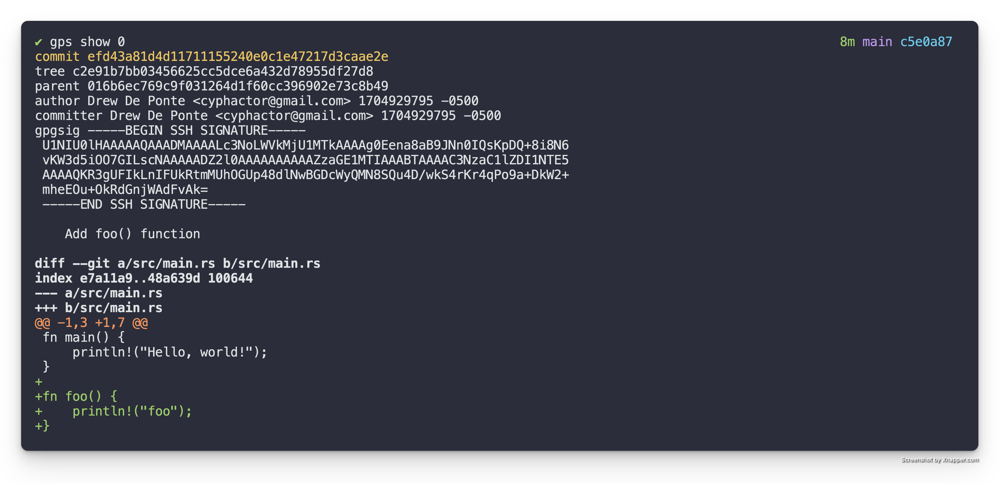
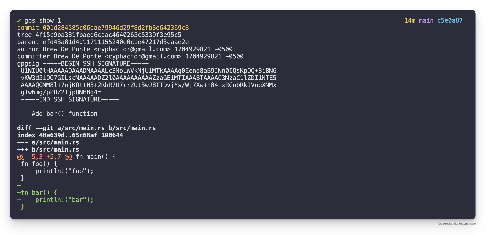
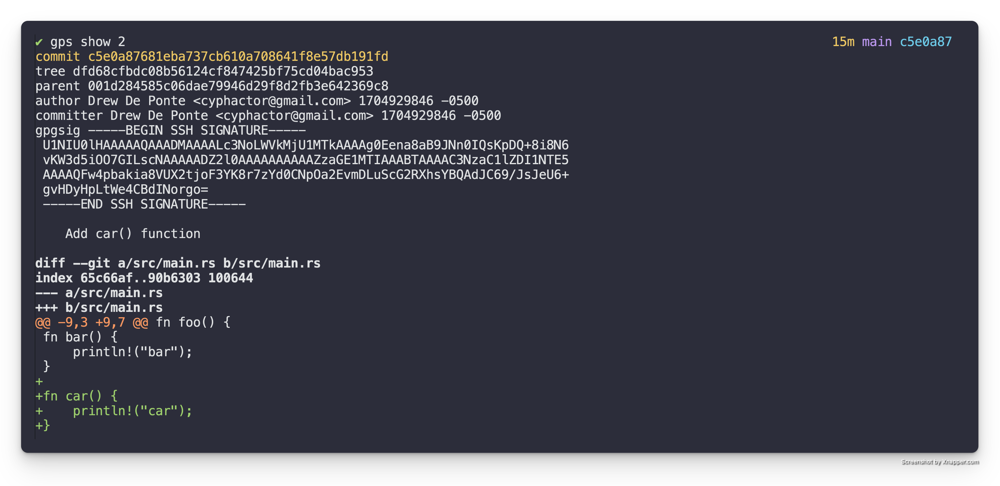
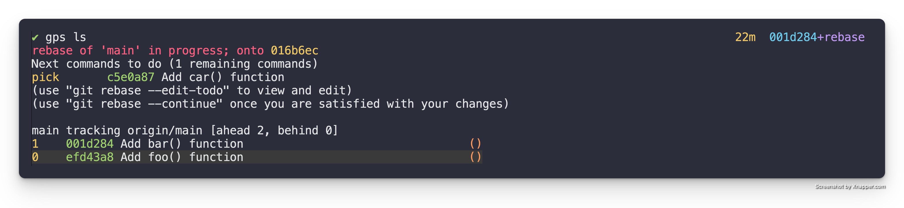
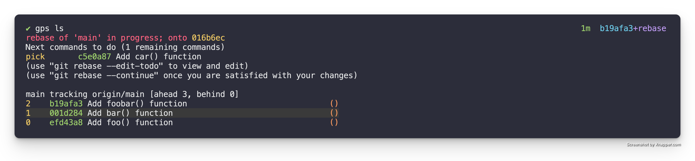
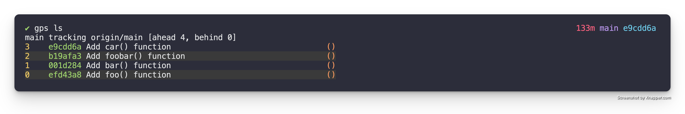

# Add a patch in the middle

Another common action you will want to perform when working with a stack of
patches is being able to add a patch at a specific point in the middle of your
stack.

This is beneficial over adding a patch on top of the stack and reordering it
into its correct position because it makes it so that when you are creating
your patch it is based on the correct dependent code and not code that is only
introduced higher up in the stack. It also has the benefit of forcing you to
properly integrate changes higher up in the stack with your newly introduced
patch.

This operation is really just a specific use case of a Git interactive rebase.
So as with most of these operations being comfortable with Git's interactive
rebase is key.

## TL;DR

For those who just want a quick reminder reference here is the TL;DR. For those
who need a bit more context and detail through the walk through read the
sections below.

- `gps rebase` - do an interactive rebase of the patch stack & mark the patch
  you want to add a new patch after with `edit`, it will drop you out into the
  shell at that patch
- make your changes to the code
- `git add` - stage changes you want in the patch
- `git commit` - create the patch
- `git rebase --continue` - continue the rebase to play the other commits on
  top of the new commits you created

## Initial State

For this example lets assume that we have a Patch Stack that has the following
patches. 



As we can see from the first patch `Add foo() function`, it adds the `foo()`
function.



The second patch, `Add bar() function`, adds the `bar()` function as seen in
the diff below.



The third patch, `Add car() function` adds the `car()` function in the diff
below.



## Add the foobar() function

Let us say for sake of discussion we want to add a new function, `foobar()`
that is composed of the `foo()` and `bar()` functions respectively. So we want
to write something like the following.

```rust
fn foobar() {
	foo();
	bar();
}
```

### Edit Mode

To accomplish this we need to utilize an interactive rebase to enter "edit"
mode in the correct place in the Patch Stack. In this particular case we
want to rebase our Patch Stack.

```
gps rebase
```

This will bring up the following in your editor.

```
pick efd43a8 Add foo() function
pick 001d284 Add bar() function
pick c5e0a87 Add car() function

# Rebase 016b6ec..c5e0a87 onto 016b6ec (3 commands)
#
# Commands:
# p, pick <commit> = use commit
# r, reword <commit> = use commit, but edit the commit message
# e, edit <commit> = use commit, but stop for amending
# s, squash <commit> = use commit, but meld into previous commit
# f, fixup [-C | -c] <commit> = like "squash" but keep only the previous
#                    commit's log message, unless -C is used, in which case
#                    keep only this commit's message; -c is same as -C but
#                    opens the editor
# x, exec <command> = run command (the rest of the line) using shell
# b, break = stop here (continue rebase later with 'git rebase --continue')
# d, drop <commit> = remove commit
# l, label <label> = label current HEAD with a name
# t, reset <label> = reset HEAD to a label
# m, merge [-C <commit> | -c <commit>] <label> [# <oneline>]
#         create a merge commit using the original merge commit's
#         message (or the oneline, if no original merge commit was
#         specified); use -c <commit> to reword the commit message
# u, update-ref <ref> = track a placeholder for the <ref> to be updated
#                       to this position in the new commits. The <ref> is
#                       updated at the end of the rebase
#
# These lines can be re-ordered; they are executed from top to bottom.
#
# If you remove a line here THAT COMMIT WILL BE LOST.
#
# However, if you remove everything, the rebase will be aborted.
#
```

In the interactive rebase buffer we want to change the action for the `Add
bar() function` patch to `edit`, so it is as follows.

```
pick efd43a8 Add foo() function
edit 001d284 Add bar() function
pick c5e0a87 Add car() function

# Rebase 016b6ec..c5e0a87 onto 016b6ec (3 commands)
#
# Commands:
# p, pick <commit> = use commit
# r, reword <commit> = use commit, but edit the commit message
# e, edit <commit> = use commit, but stop for amending
# s, squash <commit> = use commit, but meld into previous commit
# f, fixup [-C | -c] <commit> = like "squash" but keep only the previous
#                    commit's log message, unless -C is used, in which case
#                    keep only this commit's message; -c is same as -C but
#                    opens the editor
# x, exec <command> = run command (the rest of the line) using shell
# b, break = stop here (continue rebase later with 'git rebase --continue')
# d, drop <commit> = remove commit
# l, label <label> = label current HEAD with a name
# t, reset <label> = reset HEAD to a label
# m, merge [-C <commit> | -c <commit>] <label> [# <oneline>]
#         create a merge commit using the original merge commit's
#         message (or the oneline, if no original merge commit was
#         specified); use -c <commit> to reword the commit message
# u, update-ref <ref> = track a placeholder for the <ref> to be updated
#                       to this position in the new commits. The <ref> is
#                       updated at the end of the rebase
#
# These lines can be re-ordered; they are executed from top to bottom.
#
# If you remove a line here THAT COMMIT WILL BE LOST.
#
# However, if you remove everything, the rebase will be aborted.
#
```

When you save & quit the editor it will run the specified interactive rebase
commands. In this case pick (meaning keep) the first patch and then stop on the
second patch allowing for editing because we specified, `edit`. When it does
this it will drop you back to the console with a message similar to the
following:

```
Stopped at 001d284...  Add bar() function
You can amend the commit now, with

  git commit --amend '-S'

Once you are satisfied with your changes, run

  git rebase --continue
```

**Note:** This drops you right after the patch (a.k.a. commit) that was marked
for `edit` in the interactive rebase. We can see this if we look run `gps ls`.



### Add `foobar()` function patch

Now that we know that we are in the middle of a rebase, and we know where we
are located in terms of the patches. We are ready to simply create a new patch
right where we are.

When we open the `src/main.rs` file to add the new `foobar()` function we see
the following.

```rust
fn main() {
    println!("Hello, world!");
}

fn foo() {
  println!("Foo");
}

fn bar() {
  println!("Bar");
}
```

**Note:** We do **NOT** see the `car()` function. That is because that patch is
above our current location in the stack. Which is exactly what we want.

So we add the `foobar()` function so our code is as follows.

```rust
fn main() {
    println!("Hello, world!");
}

fn foo() {
  println!("Foo");
}

fn bar() {
  println!("Bar");
}

fn foobar() {
  foo();
  bar();
}
```

Then we stage the change with `git add` and create the patch with `git commit`
as we normally would. After creating the patch if we look at the `gps ls`
output we will see the following.



Here we can see the new `Add foobar() function` patch but we can also see that
the `Add car() function` patch isn't stacked on top of it yet. This is because
we are still in the middle of the rebase.

### Finish the Rebase

To replay the rest of the patches on top of the new patch(es) we just created
we simply run the following.

```
git rebase --continue
```

### Potential Conflicts

Depending on the changes you made you may run into conflicts that you created
with the patches above. This is actually exactly what you want because if you
made the change in the correct location in your stack then you want it to force
you to integrate the above patches with the new change.

In the case of our example we get the following output telling us there is a
conflict.

```
Auto-merging src/main.rs
CONFLICT (content): Merge conflict in src/main.rs
error: could not apply c5e0a87... Add car() function
hint: Resolve all conflicts manually, mark them as resolved with
hint: "git add/rm <conflicted_files>", then run "git rebase --continue".
hint: You can instead skip this commit: run "git rebase --skip".
hint: To abort and get back to the state before "git rebase", run "git rebase --abort".
Could not apply c5e0a87... Add car() function
```

This happened because the `foobar()` function definition that we introduced
into the `src/main.rs` file was added in the same location that the `car()`
function definition was created before.

If we look at `src/main.rs` right now it looks like the following.

```rust
fn main() {
    println!("Hello, world!");
}

fn foo() {
  println!("Foo");
}

fn bar() {
  println!("Bar");
}

<<<<<<< HEAD
fn foobar() {
  foo();
  bar();
=======
fn car() {
  println!("Car");
>>>>>>> 3d490f8 (Add car() function)
}
```

We can resolve this by simply moving the `car()` definition down below
`foobar()` and remove the conflict markers like so.

```rust
fn main() {
    println!("Hello, world!");
}

fn foo() {
  println!("Foo");
}

fn bar() {
  println!("Bar");
}

fn foobar() {
  foo();
  bar();
}

fn car() {
  println!("Car");
}
```

Then we simply stage the conflict resolution state with `git add` and request
that it continue the rebase with `git rebase --continue`.

Since we have resolved all the conflicts we see the following out.

```
[detached HEAD e9cdd6a] Add car() function
 1 file changed, 4 insertions(+)
Successfully rebased and updated refs/heads/main.
```

If we list our Patch Stack it will now look as follows.



And we have successfully added a patch into the middle of our stack!
