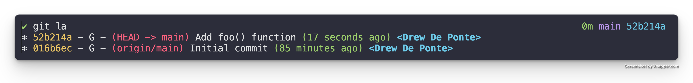
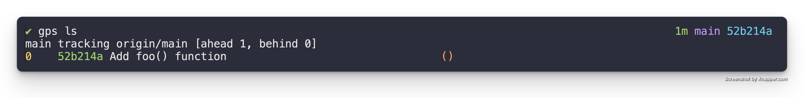
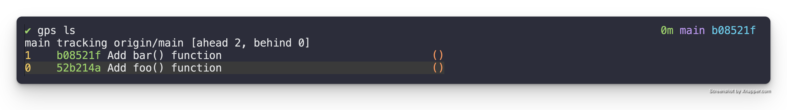

# Add patches to your stack

We're going to focus on how we create patches on our stack and what a stack is
in terms of `git`?

## TL;DR

A stack is simply a branch with an upstream tracking branch, e.g. `main` with
an upstream tracking branch of `origin/main`. You can create a patch on top of
your stack with the following.

1. Make a change locally in your editor of choice
2. Stage your change with `git add -p`
3. Create patch (a.k.a. commit) with `git commit`

## WalkThrough

Git Patch Stack is really just a layer of tooling built directly on top of
`git`. So if we look at our `git` tree here, we have a small project.


It has an initial skeleton of a Rust project. That's just a Hello World program
right now, and we can see we have a branch called `main` that were checked out
on. That's why `HEAD` points to it, and we then have an upstream `main` with a
remote of `origin`. It happens to be where `main` points to on our GitHub
repository for this.

Technically, in Git Patch Stack terms, any branch that has an upstream tracking
branch is a Patch Stack. So you can have as many of these Patch Stacks as you
want, as long as they are branches that have an upstream tracking branch. To
add patches on to a stack, you first have to be checked out on a branch that
has an associated upstream tracking branch. In our case, `main`.

### Make a change

Then we just make changes like we normally would in `git`. We add a commit and
that commit conceptually becomes a patch. So let's do that real quick. Let's go
look at our source code here. We have a `main()` function.

```rust
fn main() {
    println!("Hello, world!");
}
```

Let's say that we want to add another function called `foo()` for some reason,
and we want this function to print "Foo", nothing too crazy.  So we add a
function.  We're not even going to use the function. We're just going to add it
to the code base so that we can use it in the future.

```rust
fn main() {
    println!("Hello, world!");
}

fn foo() {
    println!("Foo");
}
```

That's it. Now we just do a `git diff` to verify our changes.

```diff
diff --git a/src/main.rs b/src/main.rs
index e7a11a9..0e47771 100644
--- a/src/main.rs
+++ b/src/main.rs
@@ -1,3 +1,7 @@
 fn main() {
     println!("Hello, world!");
 }
+
+fn foo() {
+    println!("Foo");
+}
```

> I have a git alias of `di` setup, so I can just run `git di` to get the diff
> quicker.

Once we verify the change is what we want, then we stage that change. We can
stage that change by doing a `git add`. Now we can do a `git diff --cached` and
that will show us all the changes that are staged as a diff.

```diff
diff --git a/src/main.rs b/src/main.rs
index e7a11a9..0e47771 100644
--- a/src/main.rs
+++ b/src/main.rs
@@ -1,3 +1,7 @@
 fn main() {
     println!("Hello, world!");
 }
+
+fn foo() {
+    println!("Foo");
+}
```

It looks good. Looks like the changes we want.

> I have a git alias of `dc` setup, so I can just run `git dc` to get the staged
> diff quicker.

### Create Patch on Stack

If we do a `git commit`, it pops up the configured editor, and we can enter the
commit message. 

```
Add foo() function

So that in the future we can print the message when necessary.
```

Ideally, we would provide more context but because this is a contrived example.
We don't really have it. Now we have a commit (a.k.a. patch).



If we look at our `git` tree, you can see we have a commit here that we're
pointing to on `main`, which is the "Add foo() function" patch. And then
underneath that in the tree, we have the initial skeleton commit we had before.

Now, if we run `gps ls`, which is how we list our stack of patches.



We can now see that our stack of patches consists of one patch.

### Add another Patch

So let's add another one real quick just so we can see what it's like to have
two. Let's just copy this and paste that, and change this word to bar, change
this to bar, and then we'll add another function.

```rust
fn main() {
    println!("Hello, world!");
}

fn foo() {
    println!("Foo");
}

fn bar() {
    println!("Bar");
}
```

Now we just `git add`, `git dc` to verify our staged code. All looks good. We
create another patch using `git commit` and enter the message.

```
Add bar() function

So that we can print the "Bar" message in the future.
```

Now we should have two patches in our stack.



We have patches zero, which is the index of the "Add foo() function" patch. And
we have patch one which is the index of the "Add bar() function" patch.

The short SHA of these patches, a.k.a. commits, is visible to the right of the
index and status space. We can also see the patch summaries to the right of the
short SHA.

As you get into Git Patch Stack further, you'll see status indications here
that will indicate things like whether that patch has been requested for
review, the patch has been integrated, or if there's been changes since you
requested review. But for now that's it.

That's how you add a patch to the top of your stack.

Hope you enjoyed.
