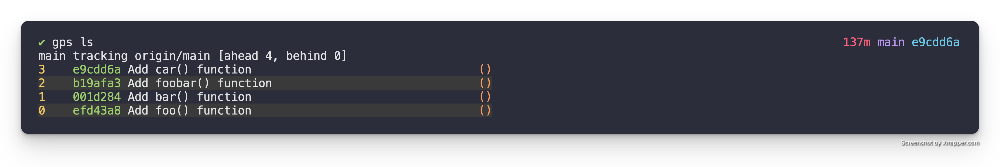
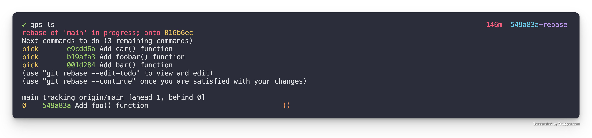
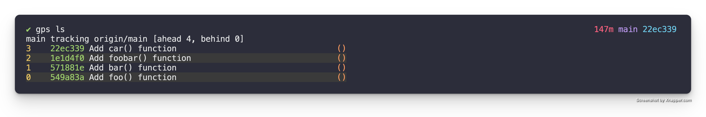

# Edit a patch

Given that part of Git Patch Stack is iterating on patches you will likely need
to modify an existing patch. One common way of modifying an existing patch is
to amend it.

This is beneficial over adding a patch on top of the stack, reordering it into
its correct position, and squashing it because it makes it so that when you
are amending your patch it is based on the correct dependent code and not code
that is only introduced higher up in the stack. It also has the benefit of
forcing you to properly integrate changes higher up in the stack with your
newly introduced patch.

This operation is really just a specific use case of a Git interactive rebase.
So as with most of these operations being comfortable with Git's interactive
rebase is key.

## TL;DR

For those who just want a quick reminder reference here is the TL;DR. For those
who need a bit more context and detail, the walk through provides it in the
sections below.

- `gps rebase` - do an interactive rebase of the patch stack & mark the patch
  you want to amend with `edit`, it will drop you out into the shell at that
  patch
- make your changes to the code
- `git add` - stage changes you want to amend to the patch marked with `edit`
- `git commit --amend` - amend the current patch
- `git rebase --continue` - continue the rebase to play the other commits on
  top of the new commits you created

## Initial State

For this example let's assume that we have a Patch Stack that has the following
patches. 



## Amend the foo() function

Let us say for sake of discussion we want to amend the, `Add foo() function`
patch so that it instead prints out `"Hello Foo"`.

### Edit Mode

To accomplish this we need to utilize an interactive rebase to enter "edit"
mode in the correct place in the Patch Stack. In this particular case we
want to rebase our Patch Stack.

```
gps rebase
```

This will bring up the following in your editor.

```
pick efd43a8 Add foo() function
pick 001d284 Add bar() function
pick b19afa3 Add foobar() function
pick e9cdd6a Add car() function

# Rebase 016b6ec..e9cdd6a onto 016b6ec (4 commands)
#
# Commands:
# p, pick <commit> = use commit
# r, reword <commit> = use commit, but edit the commit message
# e, edit <commit> = use commit, but stop for amending
# s, squash <commit> = use commit, but meld into previous commit
# f, fixup [-C | -c] <commit> = like "squash" but keep only the previous
#                    commit's log message, unless -C is used, in which case
#                    keep only this commit's message; -c is same as -C but
#                    opens the editor
# x, exec <command> = run command (the rest of the line) using shell
# b, break = stop here (continue rebase later with 'git rebase --continue')
# d, drop <commit> = remove commit
# l, label <label> = label current HEAD with a name
# t, reset <label> = reset HEAD to a label
# m, merge [-C <commit> | -c <commit>] <label> [# <oneline>]
#         create a merge commit using the original merge commit's
#         message (or the oneline, if no original merge commit was
#         specified); use -c <commit> to reword the commit message
# u, update-ref <ref> = track a placeholder for the <ref> to be updated
#                       to this position in the new commits. The <ref> is
#                       updated at the end of the rebase
#
# These lines can be re-ordered; they are executed from top to bottom.
#
# If you remove a line here THAT COMMIT WILL BE LOST.
#
# However, if you remove everything, the rebase will be aborted.
#
```

In the interactive rebase buffer we want to change the action for the `Add
foo() function` patch to `edit`, so it is as follows.

```
edit efd43a8 Add foo() function
pick 001d284 Add bar() function
pick b19afa3 Add foobar() function
pick e9cdd6a Add car() function

# Rebase 016b6ec..e9cdd6a onto 016b6ec (4 commands)
#
# Commands:
# p, pick <commit> = use commit
# r, reword <commit> = use commit, but edit the commit message
# e, edit <commit> = use commit, but stop for amending
# s, squash <commit> = use commit, but meld into previous commit
# f, fixup [-C | -c] <commit> = like "squash" but keep only the previous
#                    commit's log message, unless -C is used, in which case
#                    keep only this commit's message; -c is same as -C but
#                    opens the editor
# x, exec <command> = run command (the rest of the line) using shell
# b, break = stop here (continue rebase later with 'git rebase --continue')
# d, drop <commit> = remove commit
# l, label <label> = label current HEAD with a name
# t, reset <label> = reset HEAD to a label
# m, merge [-C <commit> | -c <commit>] <label> [# <oneline>]
#         create a merge commit using the original merge commit's
#         message (or the oneline, if no original merge commit was
#         specified); use -c <commit> to reword the commit message
# u, update-ref <ref> = track a placeholder for the <ref> to be updated
#                       to this position in the new commits. The <ref> is
#                       updated at the end of the rebase
#
# These lines can be re-ordered; they are executed from top to bottom.
#
# If you remove a line here THAT COMMIT WILL BE LOST.
#
# However, if you remove everything, the rebase will be aborted.
#
```

When you save & quit the editor it will run the specified interactive rebase
commands. In this case editing the first patch and then stopping for editing
because we specified, `edit`. When it does this it will drop you back to the
console with a message similar to the following:

```
Stopped at efd43a8...  Add foo() function
You can amend the commit now, with

  git commit --amend '-S'

Once you are satisfied with your changes, run

  git rebase --continue
```

**Note:** This drops you right after the patch (a.k.a. commit) that was marked
for `edit` in the interactive rebase. We can see this if we look at the `gps
ls` output.


### Add `foobar()` function patch

Now that we know that we are located on the patch we want to amend. We are
ready to simply amend right where we are.

When we open the `src/main.rs` file and modify the `foo()` function so that it
is as follows.

```rust
fn main() {
    println!("Hello, world!");
}

fn foo() {
  println!("Hello Foo");
}
```

**Note:** We did **NOT** see the `bar()`, `foobar()`, or `car()` functions.
This is because those patches are above our current location in the stack.
Which is exactly what we want.

Then we stage the change with `git add` and amend the patch with `git commit
--amend` as we normally would. After amending the patch if we look at the `gps
ls` output we see the following.



Here we can see the amended version of `Add foo() function` patch, but we can
also see that the rest of the patches aren't stacked on top of it yet. This is
because we are still in the middle of the rebase.

### Finish the Rebase

To replay the rest of the patches on top of the new patch(es) we just created
we simply run the following.

```
git rebase --continue
```

### Potential Conflicts

Depending on the changes you made you may run into conflicts that you created
with the patches above. This is actually exactly what you want because if you
made the change in the correct location in your stack then you want it to force
you to integrate the above patches with the new change.

In the case of our example there are no conflicts.
If we check out our Patch Stack it will now look as follows.



And we have successfully amended a patch in the middle of our stack!
