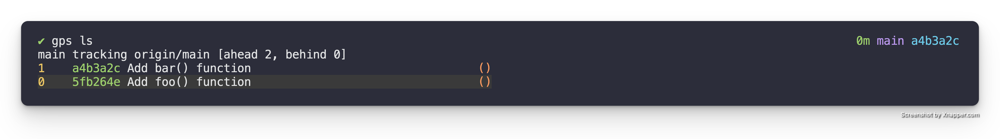

# Integrate a patch

## TL;DR

1. `gps ls` - list out patches in patch stack to the patch index you want to integrate
2. `gps int <patch-index>` - integrate the patch identified by the given patch-index

## WalkThrough

### Get Patch Index

Before we can integrate a patch. We have to identify which patch we want to
integrate and get its associated index. The best way to do this is to simply
run `gps ls` to list out the patches in the stack with their associated indices
and statuses. An example of this looks as follows.



### Integrate

In the example above lets say we wanted to integrate the `Add foo() function`
patch. We look, and it's associated index is `0` and then run the following to
trigger the integration.

```
gps int 0
```

#### Safety Check

    //     x figure out associated branch
    //     x verify has associated branch, exit with error
    //     x check to make sure patches match between stack & remote
    //     - execute hook to verify PR approval & CI status


If we tried to integrate this patch with `gps int 0` it would fail because as a
safety precaution it makes sure that the patch has an associated branch and
that the patch in the stack and the one in the branch & remote branch match. It
also runs the `integrate_verify` hook to make sure the integration should go
forward.

This can be overridden with the `-f` option as `gps int -f 0`.

#### Isolation Verification

The first step in the integration process is to run the **isolation
verification** if the configuration for it is enabled. For specifics on the
configuration checkout the [Configuration
chapter](../tool/configuration.md).

Isolation Verification is a process where a temporary branch is created that is
based on the upstream base and the patch is cherry-picked into this branch.
This verifies that at least from a Git perspective the patch is independent
enough to successfully be cherry-picked on top of the upstream base.

This however does not verify the patch is truly independent because it doesn't
address code dependencies. To address this the Isolation Verification process
supports the `isolate_post_checkout` hook. This is a hook that if present gets
executed after cherry-picking the patch into the temporary branch and checking
that branch out. It allows you to provide a `isolate_post_checkout` hook
script that can run linting, test suite, build process, etc. which can help
verify that your patch is actually independent. Details on the hook can be
found in the [Hooks chapter](../tool/hooks.md).

#### Prompt for Reassurance

Assuming the isolation verification was successful it then moves onto prompting
the user for reassurance that they want to integrate the patch. This presents
the details for the patch including the diff and then prompts the user to enter
yes/no indicating if they want to continue with the integration.

**Note:** This feature can be disabled/enabled via the configuration. More
details can be found in the [Configuration chapter](../tool/configuration.md).

#### Patches Differ Check

If the user responded `yes` to the prompt for reassurance or has it disabled
the next step in the integrate process is to check if the diff of the patch in
the patch stack matches the diff of the patch on the remote branch. This is a
precautionary check to make sure you don't accidentally integrate a patch that
is different than you think.

**Note:** `gps ls` will show you if your patches differ.

#### Actually Integrate

Assuming the above checks pass the next step in the integration process is
doing the actual integration of the patch into upstream. At a Git level this is
done similar to the following if your stack was on `main`.

```
git push origin origin/ps/rr/whatever-branch:main
```

#### Cleanup Branches

Then it cleans up the local and remote branches that were utilized during the
request review and integration process. This branch cleanup can be prevented by
passing the `-k` or `--keep-branch` option to the `gps int` command.

### List

Now that the integration is complete we can run `gps ls` to see the state of things again.


You might have noticed that it is exactly the same as the initial `gps ls`
output. This is because Git itself has no way of knowing yet that the
integration has happened.

So if you do a `gps pull` to pull down the latest state from upstream and run
`gps ls` again. You will notice that the patch that was integrated is no longer
in your stack. This is because Git detected it was integrated and removed it
from the stack for you.

**Note:** There is a configuration option for the `integrate` command that when
enabled will cause the integrate command to run a `gps pull` for you when it
was successful. This will make it so this awkward state where you still have
the integrated patch in your stack isn't observable anymore. More details can
be found in the [Configuration chapter](../tool/configuration.md).

That is how a patch is integrated.
