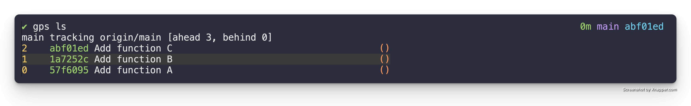
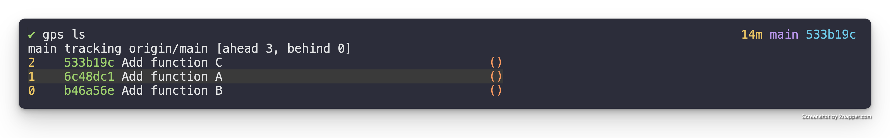

# Reorder patches

One of the core concepts of Git Patch Stack is this idea of starting out with
patches in a non-reviewable state and then iterating on them to get them to a
state where they are ready for review. As we iterate on various patches it is
crucial to be able to reorder the patches on your stack so that the
dependencies can be moved to the bottom of the stack.

## TL;DR

1. `gps rebase`
2. reorder the commit lines presented, in your configured editor, into the order you want them
3. save and quit the editor

## WalkThrough

The `gps rebase` command is a convenience function that really runs an
interactive rebase of the stack on top of it's associated upstream, e.g. `git
rebase -i --onto origin/main origin/main main`.

So understanding how to reorder patches with this command is really simply
learning how to reorder commits using git's interactive rebase.

Let's start with the following patch stack (`gps ls`).



Let's say that function B needs to become a dependency of function A. In order
to put our stack into a state where we can actually iterate on function A
adding B as a dependency we need to first reorder the patches so that "Add
function B" is at the bottom of the stack.

To do this we start by running `gps rebase` to kick off the interactive rebase.
It presents the following in our configured editor.

```
pick 57f6095 Add function A
pick 1a7252c Add function B
pick abf01ed Add function C

# Rebase 016b6ec..abf01ed onto 016b6ec (3 commands)
#
# Commands:
# p, pick <commit> = use commit
# r, reword <commit> = use commit, but edit the commit message
# e, edit <commit> = use commit, but stop for amending
# s, squash <commit> = use commit, but meld into previous commit
# f, fixup [-C | -c] <commit> = like "squash" but keep only the previous
#                    commit's log message, unless -C is used, in which case
#                    keep only this commit's message; -c is same as -C but
#                    opens the editor
# x, exec <command> = run command (the rest of the line) using shell
# b, break = stop here (continue rebase later with 'git rebase --continue')
# d, drop <commit> = remove commit
# l, label <label> = label current HEAD with a name
# t, reset <label> = reset HEAD to a label
# m, merge [-C <commit> | -c <commit>] <label> [# <oneline>]
#         create a merge commit using the original merge commit's
#         message (or the oneline, if no original merge commit was
#         specified); use -c <commit> to reword the commit message
# u, update-ref <ref> = track a placeholder for the <ref> to be updated
#                       to this position in the new commits. The <ref> is
#                       updated at the end of the rebase
#
# These lines can be re-ordered; they are executed from top to bottom.
#
# If you remove a line here THAT COMMIT WILL BE LOST.
#
# However, if you remove everything, the rebase will be aborted.
#
```

To reorder the commits we simply reorder the lines of text in this buffer so
that they are in the order we want. *Note:* The stack is inverted when
presented in an interactive rebase. So the bottom most commit on the stack is
actually the top most commit. To accomplish our goals lets swap "Add function
A" and "Add function B" as follows.

```
pick 1a7252c Add function B
pick 57f6095 Add function A
pick abf01ed Add function C

# Rebase 016b6ec..abf01ed onto 016b6ec (3 commands)
#
# Commands:
# p, pick <commit> = use commit
# r, reword <commit> = use commit, but edit the commit message
# e, edit <commit> = use commit, but stop for amending
# s, squash <commit> = use commit, but meld into previous commit
# f, fixup [-C | -c] <commit> = like "squash" but keep only the previous
#                    commit's log message, unless -C is used, in which case
#                    keep only this commit's message; -c is same as -C but
#                    opens the editor
# x, exec <command> = run command (the rest of the line) using shell
# b, break = stop here (continue rebase later with 'git rebase --continue')
# d, drop <commit> = remove commit
# l, label <label> = label current HEAD with a name
# t, reset <label> = reset HEAD to a label
# m, merge [-C <commit> | -c <commit>] <label> [# <oneline>]
#         create a merge commit using the original merge commit's
#         message (or the oneline, if no original merge commit was
#         specified); use -c <commit> to reword the commit message
# u, update-ref <ref> = track a placeholder for the <ref> to be updated
#                       to this position in the new commits. The <ref> is
#                       updated at the end of the rebase
#
# These lines can be re-ordered; they are executed from top to bottom.
#
# If you remove a line here THAT COMMIT WILL BE LOST.
#
# However, if you remove everything, the rebase will be aborted.
#
```

We then save and quit the editor, and it reorders the commits as part of the
rebase. This leaves our patch stack as follows (`gps ls`).



Exactly the state we wanted it to be in so that we can iterate on the "Add
function A" patch to make it integrate with function B.
