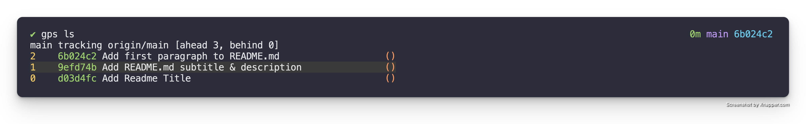
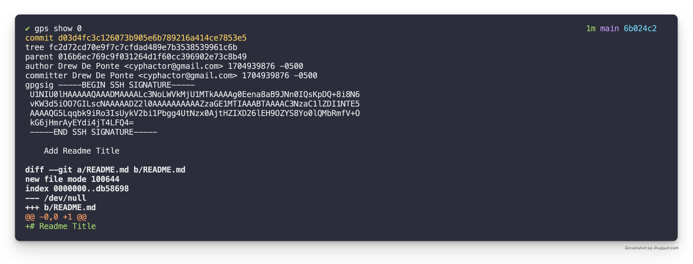
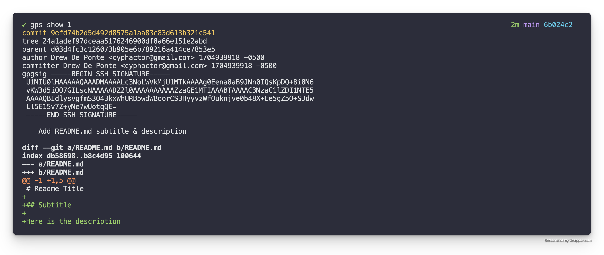
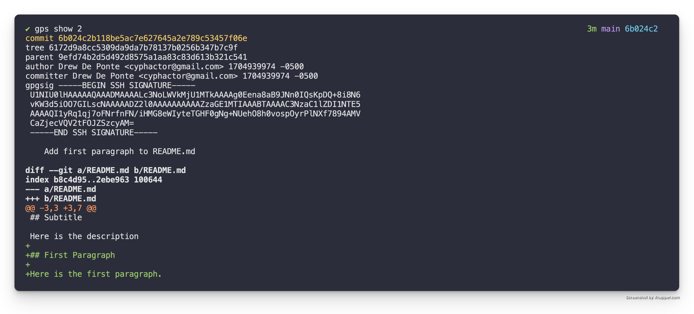
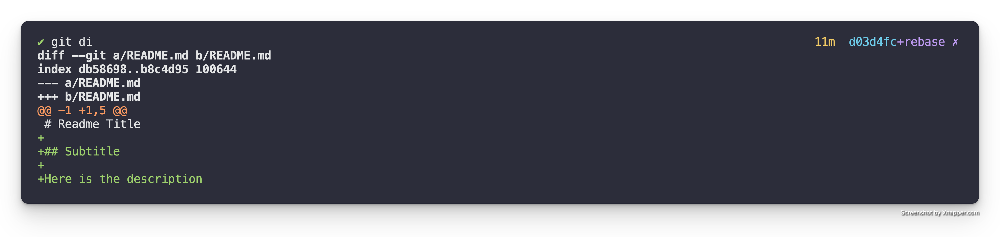
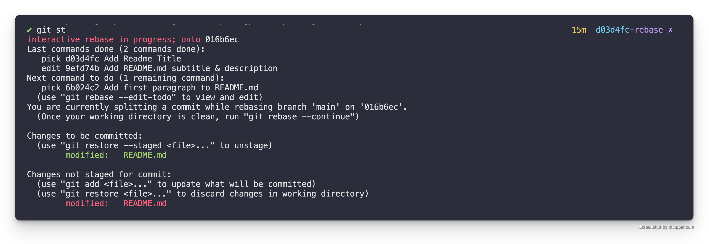
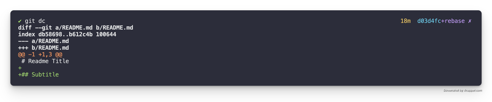
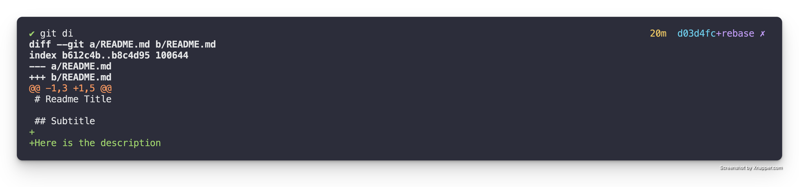
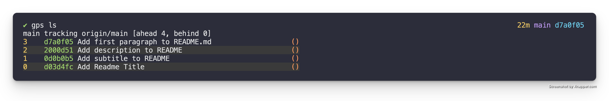

# Split a patch up

When you first discover the importance of logically structured Git commits
(a.k.a. patches), which is by the way a core fundamental expectation & design
characteristic of Git and how it is intended to be used.

It naturally leads to the question, "How do I split a patch up into multiple
patches?" This is crucial because I know I am not going to get this right the
first try. Below I present a simple contrived example so that you can learn the
mechanics and process of doing this, as the mechanics & process don't change.

The other topic related to this which this guide **does not** cover is the
process of taking code and splitting it up into logical chunks. This generally
takes an understanding of the application architecture & the dependency
relationship between the various elements.

So let's get to it.

## TL;DR

For those who just want a quick reminder reference here is the TL;DR. For those
who need a bit more context and detail through the walk through read the
sections below.

- `gps rebase` - do an interactive rebase of the patch stack & mark the patch
  you want to split for `edit`, it will drop you out into the shell at that
  patch
- `git reset HEAD^` - soft reset the patch
- `git add -p` - stage just the parts you want in the first patch
- `git commit` - create the first patch
- `git add -p` - stage just the parts you want in the next patch
- `git commit` - create the next patch
- `git rebase --continue` - continue the rebase to play the other commits on
  top of the new commits you created

## Initial State

For this example let's assume that we have a Patch Stack that has the following
patches. 



As we can see from the first patch `Add Readme Title`, it adds the title to the
README.



The second patch, `Add README.md subtitle & description`, adds the
subtitle and the description as seen in the diff below.



The third patch, `Add first paragraph to README.md` adds the first paragraph in
the diff below.



## Non-Logically Structured Patch

Looking at the patch summaries & the diffs themselves we can see that the
second commit, `Add README.md subtitle & description` is actually
doing two logical things. First it is adding the subtitle. Secondly it is
adding the description to the README.


Instead of the above what we really wanted to have was one patch that adds
the subtitle and a separate patch that adds the description as two isolated
logical chunks.

### Edit Mode

To accomplish this we need to utilize an interactive rebase to enter "edit"
mode in the correct place in the Patch Stack. In this particular case we
want to rebase our Patch Stack with the following.

```
gps rebase
```

This will bring up the following in your editor.

```
pick d03d4fc Add Readme Title
pick 9efd74b Add README.md subtitle & description
pick 6b024c2 Add first paragraph to README.md

# Rebase 016b6ec..6b024c2 onto 016b6ec (3 commands)
#
# Commands:
# p, pick <commit> = use commit
# r, reword <commit> = use commit, but edit the commit message
# e, edit <commit> = use commit, but stop for amending
# s, squash <commit> = use commit, but meld into previous commit
# f, fixup [-C | -c] <commit> = like "squash" but keep only the previous
#                    commit's log message, unless -C is used, in which case
#                    keep only this commit's message; -c is same as -C but
#                    opens the editor
# x, exec <command> = run command (the rest of the line) using shell
# b, break = stop here (continue rebase later with 'git rebase --continue')
# d, drop <commit> = remove commit
# l, label <label> = label current HEAD with a name
# t, reset <label> = reset HEAD to a label
# m, merge [-C <commit> | -c <commit>] <label> [# <oneline>]
#         create a merge commit using the original merge commit's
#         message (or the oneline, if no original merge commit was
#         specified); use -c <commit> to reword the commit message
# u, update-ref <ref> = track a placeholder for the <ref> to be updated
#                       to this position in the new commits. The <ref> is
#                       updated at the end of the rebase
#
# These lines can be re-ordered; they are executed from top to bottom.
#
# If you remove a line here THAT COMMIT WILL BE LOST.
#
# However, if you remove everything, the rebase will be aborted.
#
```

In the interactive rebase buffer we can change the action for the middle patch
to `edit` so it as follows.

```
pick d03d4fc Add Readme Title
edit 9efd74b Add README.md subtitle & description
pick 6b024c2 Add first paragraph to README.md

# Rebase 016b6ec..6b024c2 onto 016b6ec (3 commands)
#
# Commands:
# p, pick <commit> = use commit
# r, reword <commit> = use commit, but edit the commit message
# e, edit <commit> = use commit, but stop for amending
# s, squash <commit> = use commit, but meld into previous commit
# f, fixup [-C | -c] <commit> = like "squash" but keep only the previous
#                    commit's log message, unless -C is used, in which case
#                    keep only this commit's message; -c is same as -C but
#                    opens the editor
# x, exec <command> = run command (the rest of the line) using shell
# b, break = stop here (continue rebase later with 'git rebase --continue')
# d, drop <commit> = remove commit
# l, label <label> = label current HEAD with a name
# t, reset <label> = reset HEAD to a label
# m, merge [-C <commit> | -c <commit>] <label> [# <oneline>]
#         create a merge commit using the original merge commit's
#         message (or the oneline, if no original merge commit was
#         specified); use -c <commit> to reword the commit message
# u, update-ref <ref> = track a placeholder for the <ref> to be updated
#                       to this position in the new commits. The <ref> is
#                       updated at the end of the rebase
#
# These lines can be re-ordered; they are executed from top to bottom.
#
# If you remove a line here THAT COMMIT WILL BE LOST.
#
# However, if you remove everything, the rebase will be aborted.
#
```

When you save & quit the editor it will run the specified interactive rebase
commands. In this case pick (meaning keep) the first patch and then stop on
the second patch allowing for editing because we specified, `edit`. When it
does this, it will drop you back to the console with a message similar to the
following:

```
Stopped at 9efd74b...  Add README.md subtitle & description
You can amend the commit now, with

  git commit --amend '-S'

Once you are satisfied with your changes, run

  git rebase --continue
```

### Split the Patch

We want to split the changes currently held in this patch into multiple
patches. To do this we need to reset the patch that we are currently on and
then partially stage the changes back & create a patch, then stage the other part and
create another patch, and then continue the rebase.

So first we have to reset just the patch that we are checked out on and we
want to do a soft reset. So we do the following:

```
git reset HEAD^
```

Now if we run `git diff` to see the now local unstaged changes we see the
following.



As we can see we now have the changes that add both the subtitle & the
description locally.

So we first want to stage a patch with just the `## Subtitle` portion. To do
this we need to use `git add -p README.md` to do a partial stage of the README
files changes to just stage the `## Subtitle` portion. See this post, [git add
patch won't split](https://drewdeponte.com/blog/git-add-patch-wont-split/) for
details on how to accomplish this. This should leave us with the following.

```
+
+Description of the README
```

If you run `git status` to check on things at this point it should look like
this.



If we specifically check out the staged changes with `git diff --staged` we get
the following.



This is exactly what we wanted. But let's make sure the unstaged changes also
represent what we want by running `git diff`.



Yep looks like they do. So now we just need to create the first of the two
patches that will replace the patch we marked for edit. This can be done as
follows.

```
git commit
```

When it opens the editor for the message we can give it a summary of
`Add subtitle to README`.

From there we can stage the rest of the changes with `git add README.md` and
create the second patch with the following.

```
git commit
```

When it opens the editor for the message we can give it a summary of
`Add description to README`.

### Finish the Rebase

Now that the changes have been split up into separate patches like we wanted we
now need to instruct it to finish the interactive rebase that we started with
the edit. This is done as follows.

```
git rebase --continue
```

Once it is complete if we check out our Patch Stack it will look as follows.



Exactly what we wanted!
